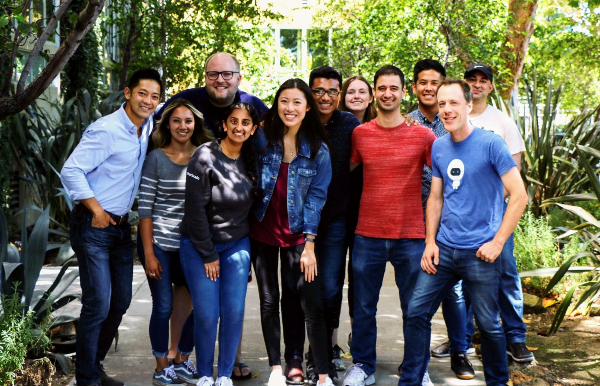

[ClearBrain](https://www.clearbrain.com/) is a startup building the first self-serve AI platform for growth marketing. Their automated ML platform helps companies predict and retarget users when they are most likely to purchase. Led by the founding engineers of Google Ads and Optimizely’s data infrastructure team, their product is used by Fortune 1000 companies to personalize ads, emails, and push notifications to millions of users every week - as effectively as Uber or Google.

I used React to build features for creating responsive data visualizations of our customers' user behavior.
Simplified customer flows to increase the efficiency of navigating ClearBrain's web app.

