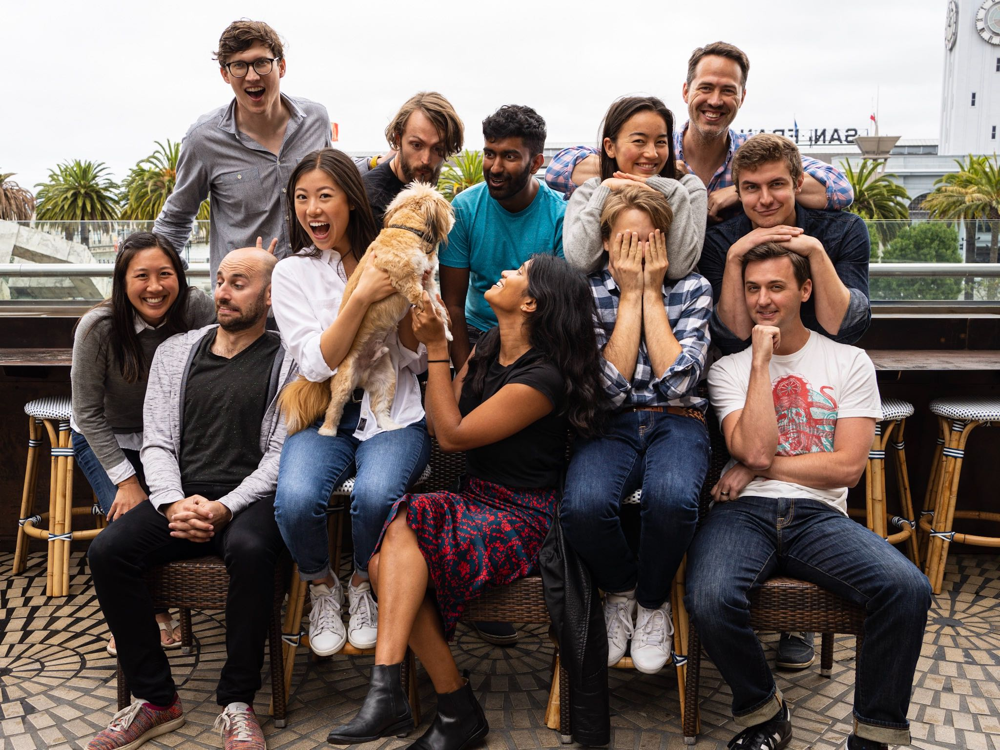

[Culdesac](https://culdesac.com/) is a post-car real estate developer creating the first car-free neighborhood built from scratch in the US.
The startup was part of the YC S18 batch and is backed by Khosla Ventures and Initialized.

I've designed and implemented a suite of web technologies as one of five engineers, focusing on delivering a seamless experience.
We develop property management software (for operators and residents) in a React, Apollo, GraphQl, Django stack.

One of my most fun experiences was spearheading an initiative to revamp the landing page as a product lead managing a cross-functional team through design, implementation, and launch.

