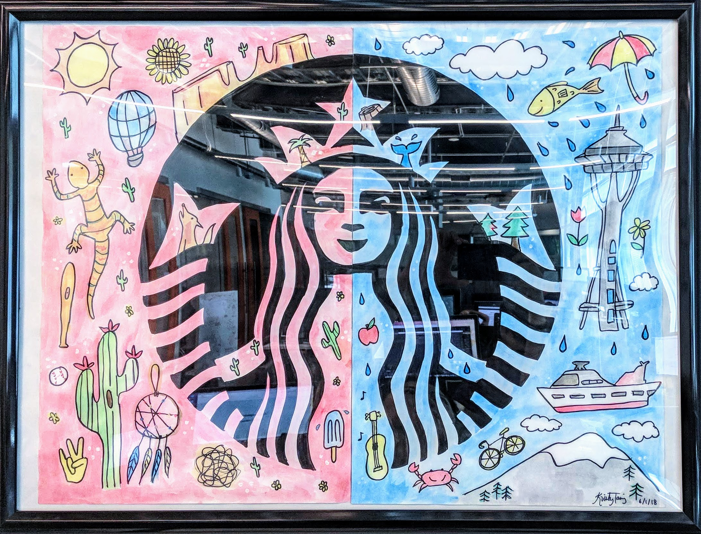

 

I used Java in a modified VIPER architecture to improve the Starbucks App (the most successful US mobile payment system).
Interfacing with the Seattle team in an Agile framework, I deployed enhancements as one of their 18 Android developers.
I implemented an updated payment methods system, fixed critical release bugs, and uplifted the design of the app.

During the internal SiX Hackathon, my team won "Best Customer Facing Project" for our integrated drink recommendation engine.

